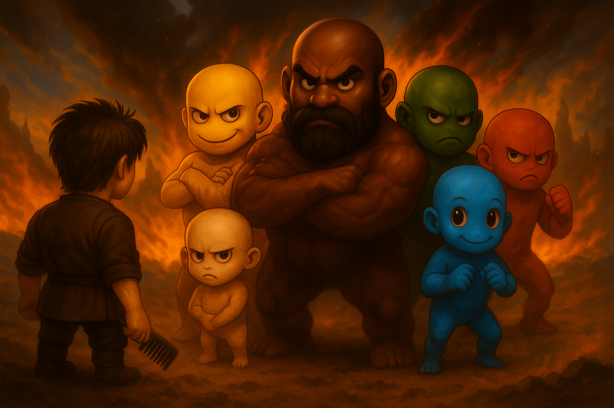
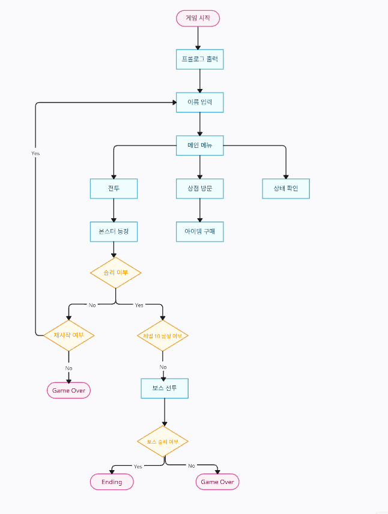

# 🧠 『 최후의 모발: 탈모 바이러스와의 전투 』

---

## 📖 프로젝트 소개

**📆 제작 기간: 2025.06.20 ~ 2025.06.26**

### 📜 프롤로그  
> 세상의 머리카락이  
> 사라지는 가운데,  
>
> **유일한 희망은 당신에게 달려 있다.**  
>
> 마지막 모발을 지키기 위한 치열한 전투에서  
> **승리하라!**

 

### 🌍 세계관  
> 2099년, 탈모 바이러스 **"B-ald 99"**가  
> 세계를 휩쓸며 인류의 머리카락을  
> 전부 사라지게 만든다.  
>
> 모든 사람의 머리가  
> 반짝이기 시작하며,  
>
> 머리카락을 지키기 위한  
> 마지막 희망은 단 한 명,  
> 바로 **주인공**에게 달려 있다.  
>
> 주인공은 유일한 모발 보유자로서,  
> **‘대머리 군단’**과 치열한 전투를 벌이며  
> 세상을 구하기 위한 싸움에 나선다.

 

## 🎯 프로젝트 목표

- **언리얼 스타일 클래스 구조**
  `BeginPlay`, `Tick` 기반의 클래스 구조 설계
- **턴제 전투 시스템**
  플레이어의 성장을 반영한 턴제 전투 시스템 개발
- **레벨 제한 던전**
  레벨에 따라 입장 제한이 있는 3단계 던전 구현
- **아이템 구매/사용**
  아이템 구매 및 사용을 통해 전략적 플레이 유도
- **보스 몬스터 및 결말 분기**
  보스 몬스터 등장과 결말 분기 연출 구현
- **게임 저장/불러오기**
  게임 데이터를 저장하고 불러와 이전 상태로 이어서 진행 가능

 

## 🧩 주요 기능

- **턴제 전투 시스템**  
  공격, 아이템 사용, 도망 등 선택지 기반 전투

- **몬스터별 랜덤 대사 출력**   
  전투 시작 시 다양한 대사 출력으로 몰입도 상승

- **상점 시스템**  
  공격/회복 아이템 구매 가능, 자금 사용 전략

- **레벨업 시스템**  
  경험치 획득 후 능력치 상승 및 던전 해금

- **보스 몬스터와의 최종 전투**  
  레벨 10 달성 시 특별 이벤트 및 결말 분기 발생

- **콘솔 UI 기반 두피 상태 리포트**  
  현재 체력, 레벨, 경험치, 자금 등 상태 정보 출력

- **Save**
  게임 데이터를 저장하여 이어서 진행 가능

- **불러오기** 
  저장된 데이터로 게임을 이어서 진행

 

## 🔁 Game Flow Chart

텍스트 기반 RPG 게임으로, 플레이어는 머머리 군단과 맞서 싸우며  
레벨을 올리고 최종 보스를 물리치는 것이 목표입니다.

게임은 프롤로그와 함께 세계관을 소개한 뒤,  
플레이어가 이름을 입력하고 본격적인 여정을 시작하는 방식으로 진행됩니다.

메인 메뉴에서는 전투, 상점 방문, 상태 확인 중 하나를 선택할 수 있으며,  
전투에서는 무작위로 등장하는 몬스터와 싸우게 됩니다.

전투에서 승리하면 경험치와 보상을 획득하고, 이를 통해 레벨이 상승합니다.  
레벨 10에 도달하면 최종 보스인 ‘진영형님’이 등장하며, 보스전이 시작됩니다.

전투에서 패배할 경우에는 재시작 여부를 묻는 분기가 발생하고,  
플레이어는 게임을 재시작하거나 그대로 종료할 수 있습니다.

보스 몬스터를 처치하면 게임은 엔딩으로 이어지고 성공적으로 종료됩니다.

상점에서는 골드를 사용해 아이템을 구매할 수 있으며,  
상태 확인 메뉴를 통해 플레이어의 체력, 레벨 등의 상태를 확인할 수 있습니다.

게임은 단계적인 루프 구조로 진행되며,  
플레이어의 선택과 전투 결과에 따라 다양한 분기로 전개됩니다.

 

## 🔍 코드 분석  

🔗 [Code Analysis](https://www.notion.so/kimyeoul/Code-Analysis-21dcf60eefb680a5ade6c291a2a0c618)

 

## 📦 데이터 규격   

🔗 [Data spec](https://www.notion.so/kimyeoul/Data-spec-21dcf60eefb680fabf95eabc4146623a)

 

## 👥 역할 및 작업 노션

| 담당 역할 | 담당자 |
|-----------|--------|
| GameManager, Item| 김기탁, 김여울, 허진영 |
| Character | 김슬빈 |
| Monster, SaveManager, Dungeon | 임동휘 |
| Shop | 조한형 |

- 🔗 [GameManager](https://www.notion.so/kimyeoul/GameManager-217cf60eefb680a0a364f36bddd7ac15)
- 🔗 [Item](https://www.notion.so/kimyeoul/Item-218cf60eefb680e18974ea8fd56f7499)
- 🔗 [Character](https://www.notion.so/kimyeoul/Character-218cf60eefb680e88adde76a4bb12992)
- 🔗 [Monster, SaveManager, Dungeon](https://www.notion.so/kimyeoul/Monster-218cf60eefb680038bcfc422e9b17903)
- 🔗 [Shop](https://www.notion.so/kimyeoul/Shop-218cf60eefb680bda8b9f886ef89811c)

 

## 🎥 시연 영상

🔗 준비 중 (업로드 예정)

 

## 🛠 사용한 툴

- [Visual Studio 2022](https://visualstudio.microsoft.com/vs/) – 개발 및 디버깅
- [Notion](https://www.notion.so/kimyeoul/CH-2-RPG-218cf60eefb680b288bbfd44698b999c) – 기획, 정리
- [Creately](https://app.creately.com/d/sJeIGyQL8LT/edit) – Game Flow Chart 제작
- [Image to ASCII](https://www.asciiart.eu/image-to-ascii) – ASCII 아트 변환 도구

 

## 🧑‍🤝‍🧑 17조

| 이름 | 이메일 | GitHub |
|------|--------|--------|
| 김기탁 | alaalxk@gmail.com | [@mimmita1032](https://github.com/mimmita1032) |
| 김슬빈 | hataeui624@gmail.com | [@kimsluebin](https://github.com/kimsluebin) |
| 김여울 | yoohozzy@gmail.com| [@yeoulkim](https://github.com/yeoulkim) |
| 임동휘 | suaio239@gmail.com | [@suaio239](https://github.com/suaio239) |
| 조한형 | gksgud97@gmail.com | [@yah0834](https://github.com/yah0834) |
| 허진영 | dogne2@naver.com | [@HJY8682](https://github.com/HJY8682) |
